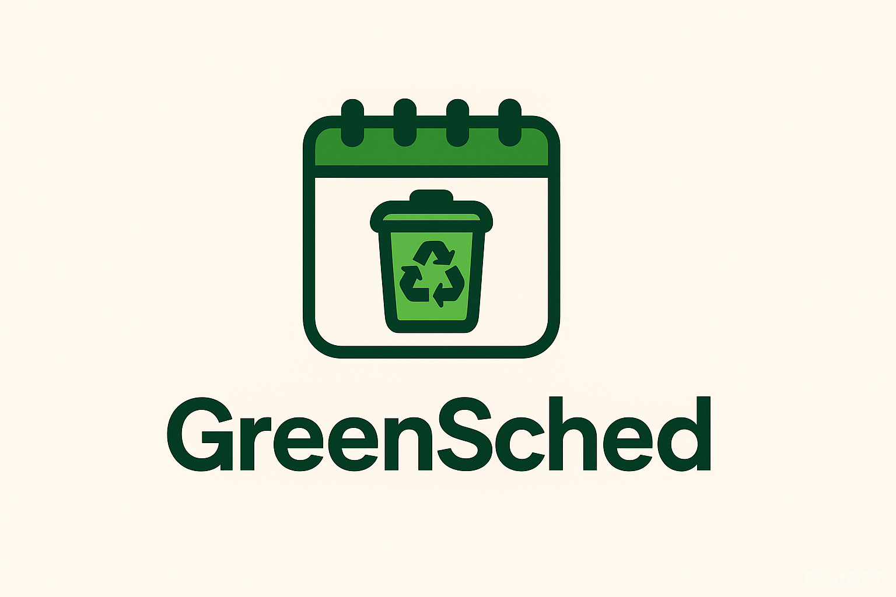

# GreenSched

<p align="center">
  
</p>

<!-- Tabella BC con badge -->
<table align="center">
  <thead>
    <tr>
      <th>Name</th>
      <th>Abstract</th>
      <th>Status</th>
      <th>Build</th>
      <th>Coverage</th>
      <th>Maintainability</th>
    </tr>
  </thead>
  <tbody>
    <tr>
      <td>Identity BC</td>
      <td>Manages user registration, authentication, and roles.</td>
      <td>TBD</td>
      <td></td>
      <td></td>
      <td></td>
    </tr>
    <tr>
      <td>Calendar BC</td>
      <td>Handles calendar creation, versioning, duplication, and soft delete.</td>
      <td>TBD</td>
      <td></td>
      <td></td>
      <td></td>
    </tr>
    <tr>
      <td>Collaboration BC</td>
      <td>Manages subscriptions, comments, ratings, and visibility of shared calendars.</td>
      <td>TBD</td>
      <td></td>
      <td></td>
      <td></td>
    </tr>
    <tr>
      <td>BFF</td>
      <td>Backend-for-Frontend orchestrating data from all BCs for the frontend.</td>
      <td>TBD</td>
      <td></td>
      <td></td>
      <td></td>
    </tr>
  </tbody>
</table>

**Collaborative Waste Collection Calendars**  
GreenSched is an exploratory project demonstrating Domain-Driven Design (DDD), Clean Architecture (CA), Test-Driven Development (TDD), Command Query Separation (CQS), and event-driven messaging.  
The project provides a web frontend built with React and ShadCN, Electron for desktop, and PWA capabilities for mobile. The backend is implemented in Spring Boot with microservices representing autonomous Bounded Contexts (BCs).

---

## Table of Contents

1. [Overview](#overview)  
2. [Running Locally](#running-locally)  
3. [Conduct](#conduct)  
4. [Contributing](#contributing)  
5. [License](#license)

---

## Overview

GreenSched allows users to view, create, share, and manage municipal waste collection calendars. Features include user registration, calendar versioning, subscriptions, private notes, comments, and ratings.  
The architecture is based on autonomous Bounded Contexts (Identity, Calendar, Collaboration) and a BFF for orchestrating frontend interactions.

---

## Running Locally

Follow these instructions to start the project locally. Ensure you have **Node.js**, **npm/yarn**, **Java 17+**, and **Docker** installed.  

### Frontend
```bash
cd frontend
npm install
npm run dev
# or for Electron desktop
npm run electron:dev
# for PWA
npm run build && npm run serve
```

### BFF
```bash
cd bff
./mvnw clean install
./mvnw spring-boot:run
```

### Identity BC
```bash
cd services/identity
./mvnw clean install
./mvnw spring-boot:run
```

### Calendar BC
```bash
cd services/calendar
./mvnw clean install
./mvnw spring-boot:run
```

### Collaboration BC
```bash
cd services/collaboration
./mvnw clean install
./mvnw spring-boot:run
```

> Optionally, use `docker-compose up` for supporting services (PostgreSQL, RabbitMQ, Redis).

---

## Conduct

We expect all contributors to follow professional and respectful communication. Collaboration, knowledge sharing, and constructive feedback are encouraged.  
Please maintain clean commits and descriptive commit messages. Avoid including sensitive data in commits.

---

## Contributing

This project follows the TBD GitHub Flow.  
1. Fork the repository.  
2. Create a feature branch: `feature/<feature-name>`.  
3. Commit your changes with clear messages.  
4. Open a pull request against the `main` branch.  
5. Ensure tests pass and code is reviewed before merging.  

For major changes, please open an issue first to discuss the proposed modifications.

---

## License

This project is licensed. See the [LICENSE](LICENSE) file for details.
